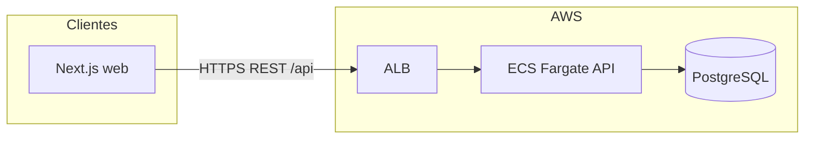

# Arquitetura

**Padrão:** Monólito modular em monorepo — uma API NestJS stateless + app Next.js; dados relacionais no PostgreSQL via Prisma; deploy API containerizado na AWS (ECS).

## Visão de alto nível

- O **web** chama a API REST com Bearer JWT após login; respostas sempre envelopadas e normalizadas no cliente axios.
- **`@org/types`** centraliza contratos de payload/query compartilhados.

## Backend NestJS — organização

- **Módulos por domínio** em `apps/api/src/modules/`: `auth`, `users`, `roles`, `addresses`, `establishments`, `categories`, `service-offers`, `health`.
- Padrão alvo (documentado em regras): `controllers/`, `services/`, `repositories/`, `contracts/*-repository.interface.ts`, `dto/`, `*.module.ts`.
- **Persistência:** `PrismaService` + repositórios que estendem `BaseRepository` (`common/repositories/base.repository.ts`) com `paginate()` genérico.
- **Cross-cutting:** `TransformInterceptor` (envelope de sucesso), `HttpExceptionFilter`, `JwtAuthGuard` + `RolesGuard`, decorator `@Public()` para rotas abertas.

## Modelo de dados (Prisma) — resumo

- **User:** autenticação, `addressId` opcional, `controls` JSON opcional; relação 1:1 opcional com **Establishment** (`ownerId` único).
- **Establishment:** nome, descrição, logo, website, `addressId`, **`controls` JSON** (extensível para segmento, uniforme, etc.).
- **Address:** endereço BR-oriented (CEP, cidade, UF, etc.) + `controls` JSON.
- **Role** / **UserRole:** papéis de usuário (freelancer vs dono refletidos também por presença de `establishment` no perfil).
- **ServiceOffer:** título, descrição, orçamento (`BudgetType`), `deadline`, `status`, vínculo a `Establishment` e `Category` opcional; **ServiceOfferRole** liga ofertas a **Role** requeridas; **ServiceSubscription** para candidaturas/reservas; **Review**.

## Fluxos principais

### Autenticação

1. Registro/login via `AuthService` (Argon2, JWT access + refresh).
2. Payload JWT inclui `sub`, `email`, `roles` (slugs de `UserRole`).

### Ofertas de serviço

- **CRUD** protegido por JWT (listagem geral `GET` marcada `@Public()`).
- **Listagem paginada:** `GET /api/service-offers` + `FilterServiceOfferDto` → `ServiceOfferRepository.paginate()`.
- **Listagem aberta enriquecida:** `GET /api/service-offers/open` → `findOpenOffers()` com `include` de categoria, estabelecimento e owner (sem paginação).
- **Criação:** `CreateServiceOfferDto` resolve `establishmentId` e `categoryId` por **slug UUID**; campo `controls` JSON para metadados (ex.: turno, uniforme na oferta).

### Estabelecimentos

- CRUD/listagens com filtros; `GET /establishments/me` para dono autenticado.

## Frontend Next.js

- **App Router** com grupos como `(portal)` para áreas logadas.
- **Jobs:** `apps/web/src/app/(portal)/jobs/page.tsx` — SSR inicial via `getOpenServiceOffers()` + hidratação com `useOpenServiceOffers()` (endpoint **open**, não paginado).
- Hook **`usePaginatedServiceOffers`** implementado e alinhado a `FilterServiceOfferQueryDto`, mas **não** usado na página de jobs atualmente.

## Pontos de atenção arquiteturais (para evolução)

- Filtros de negócio (papel na oferta, data, fim de semana, localização) exigem extensão de `FilterServiceOfferDto` + queries Prisma (joins em `requiredRoles`, `establishment.address`, `deadline`).
- `BaseRepository.paginate()` no `findMany` **não** inclui relações por padrão — a lista paginada retorna linhas “secas” de `ServiceOffer`, diferente do endpoint `/open`.
